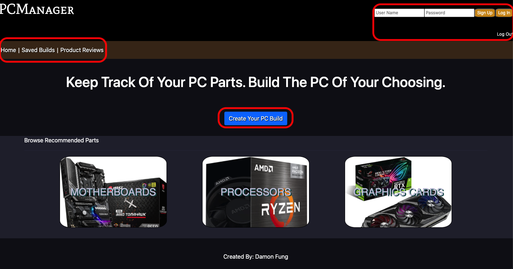

# PCManager

## About
This is a simple blog-type organizer application which allows users to keep track of 
their PC hardware/parts when trying to build their very own PC. Users will be able to
save their PC builds and review PC products that will save into a database.

## Motivation
This website was made for those who share an interest in building PCs. There are so
many components involved that it is nice to have a website to keep track of all of
your PC hardware before installing each piece. I used PCPartPicker as my inspiration
for this project.

## Technologies used
* HTML, CSS, JavaScript
* NodeJS, Express, REACT
* MongoDB, Heroku
* Postman
* Visual Studio Code
* [Wireframe.cc](https://wireframe.cc/)
* [Lucid.app](https://lucid.app/)

## How to use

<hr />
* Once on the Home page, there is a navigation bar where you can view saved PC builds when pressing "Saved Builds", or you can view product reviews by pressing "Product Reviews"
* Sign up with a username and password on the top-right corner
* Once the account is created, log in with the same credentials and you will be able to save PC builds unique to that account/user
* Additionally, you can browse recommended PC parts by clicking on any three of the buttons in the Browse Recommended Parts section
* Click the Create Your PC Build to get started on making your very own PC build (with or without being logged in) <br />

<hr />
* Fill out the form with your PC build name and PC specs and press Create Your New PC Build to submit the build into the database <br />

<hr />
* Navigate to Product Reviews in the navigation bar and press Add A New Product Review to begin reviewing a product

## For developers
Clone the source locally:
```
$ git clone https://github.com/dfung003/PC-Manager-website
$ cd pc-manager
```

## Credits
* [PCPartPicker](https://pcpartpicker.com), as my main source of inspiration on 
the functionality and appearance for my website
* [Ice Cream Selector](https://seir-ice-creams.herokuapp.com/), used to recreate how
buttons look with a background image and hover effect

## Resources
* W3 Schools: [Horizontal Nav Bar](https://www.w3schools.com/css/css_navbar_horizontal.asp),
[Star Rating](https://www.w3schools.com/howto/howto_css_star_rating.asp), 
[HTML <input> size Attribute](https://www.w3schools.com/tags/att_input_size.asp)
* Bootstrap v.4.6.1: [Primary Button](https://getbootstrap.com/docs/4.6/components/buttons/)
* [Heroku Troubleshooting](https://wajeeh-ahsan.medium.com/heroku-missing-required-flag-a-bfc7ba0a00f5)
* Wireframes: [1](https://wireframe.cc/aAeVu6), [2](https://wireframe.cc/nf3aPd), [3](https://wireframe.cc/cnuG3U), [4](https://wireframe.cc/UalGw2), [5](https://wireframe.cc/XOU0jQ)
* [ERD](https://lucid.app/lucidchart/133ec2d8-f96a-4839-9b45-a2300c256998/edit?invitationId=inv_e7e70fa6-1a1e-471c-a738-53b6a01db45a)